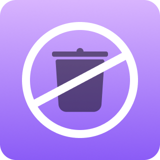
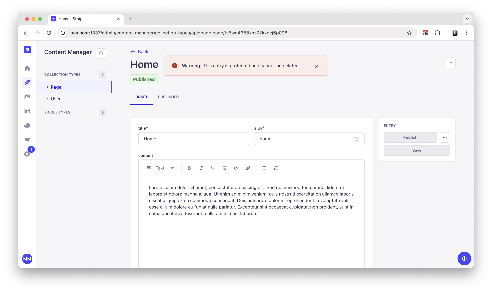

<div align="center">
  
  <h1>Strapi "Do Not Delete"</h1>
  <p>A plugin for Strapi CMS that protects certain entries from being deleted.</p>
  
</div>

## Get Started

* [Features](#features)
* [Installation](#installation)
* [Configuration](#configuration)
* [User Guide](#user-guide)
* [Troubleshooting](#troubleshooting)
* [Migration](#migration)
* [Support or Donate](#donate)
* [Roadmap](#roadmap)

## <a id="features"></a>✨ Features
* Protect certain entries from being deleted.
* Use various comparators to match against protection rules.

## <a id="installation"></a>💎 Installation
```bash
yarn add strapi-plugin-do-not-delete@latest
```

Don't forget to **restart or rebuild** your Strapi app when installing a new plugin.

## <a id="configuration"></a>🔧 Configuration
| property | type (default) | description |
| - | - | - |
| contentTypes | object (`null`) | A config object that describes protection rules for content types. |

### `contentTypes`
A config object that describes protection rules for content types using the model UID and an array of comparators.

The object keys for `contentTypes` should be a valid model UID and the value should be an array or arrays which describe the comparison rules.

#### Example
Below, the comparison rule is querying if the `slug` value for `Page` is equal to `home`, and if this condition is true, the delete operation is cancelled.

```ts
// ./config/plugins.ts`
export default () => ({
  'do-not-delete': {
    config: {
      contentTypes: {
        'api::page.page': [
          ['slug', 'is', 'home'],
        ],
      },
    },
  },
});
```

#### Comparators
The items in each comparison array must follow the format:

```ts
['attribute', 'comparator', 'value or pattern']
```

| Comparator | Description |
| -- | -- |
| `is` | Strict equality with `===` |
| `isNot` | Strict inequality with `!==` |
| `in` | Does the `value` array include `attribute`? |
| `notIn` | Does the `value` array not include `attribute`? |
| `has` | Does the `attribute` contain `value`? |
| `hasNot` | Does the `attribute` not contain `value`? |
| `lt` | Is `attribute` less than `value`? |
| `lte` | Is `attribute` less than or equal to `value`? |
| `gt` | Is `attribute` greater than `value`? |
| `gte` | Is `attribute` greater than or equal to `value`? |
| `between` | Does `attribute` fall between the pair of `values`? |
| `after` | Does `attribute` occur after the `value` date? |
| `before` | Does `attribute` occur before the `value` date? |
| `day` | Does `attribute` occur on the same day of the `value` date? |
| `month` | Does `attribute` occur in the same month of the `value` date? |
| `year` | Does `attribute` occur in the same year of the `value` date? |
| `matches` | RegExp test against `pattern` (do not include outer slashes) |

```ts
// ./config/plugins.ts`
export default () => ({
  'do-not-delete': {
    config: {
      contentTypes: {
        'api::page.page': [
          // Equality.
          ['slug', 'is', 'home'],
          ['slug', 'isNot', 'test'],

          // Contains.
          ['slug', 'in', ['home', 'blog', '404']],
          ['slug', 'notIn', ['test', 'temp']],
          ['slug', 'has', 'admin'],
          ['slug', 'hasNot', '-test'],

          // Regular expression.
          ['slug', 'matches', '^foobar'], // same as "starts with"
          ['slug', 'matches', 'foobar$'], // same as "ends with"

          // Greater than or equal to.
          ['rating', 'lt', 10],
          ['rating', 'lte', 9],
          ['rating', 'gt', 4],
          ['rating', 'gte', 5],
          ['rating', 'between', [3, 6]],

          // Dates (any valid date string format can be used).
          ['publishedAt', 'after', '2022-12-31'],
          ['publishedAt', 'before', '2020-01-01T00:00:00.000Z'],
          ['publishedAt', 'day', 'Wed, 01 Jan 2020 00:00:00 GMT'],
          ['publishedAt', 'month', 'January 2020'],
          ['publishedAt', 'year', '2023'],
        ],
      },
    },
  },
});
```

## <a id="user-guide"></a>📘 User Guide

### Attempting to delete a protected entry
When attempting to delete a protected entry, a validation error will display at the top of the screen that reads:

> This entry is protected and cannot be deleted.

### Deleting an entry that is currently protected
If you find yourself in a scenario where a protected entry actually does need to be deleted, you must first update the plugin config to remove the protection rule that applies to that entry.

## <a id="troubleshooting"></a>💩 Troubleshooting

#### In general
Remember to **rebuild your app** after making changes to some config or other code.

```bash
yarn build
# OR
yarn develop
```

## <a id="migration"></a>🚌 Migration
Follow the [migration guides](MIGRATION.md) to keep your "do not delete" plugin up-to-date.

## <a id="donate"></a>❤️ Support or Donate
If you are enjoying this plugin and feel extra appreciative, you can [buy me a beer or 3 🍺🍺🍺](https://www.buymeacoffee.com/mattmilburn).

## <a id="roadmap"></a>🚧 Roadmap
* Edit view sidebar button to "lock" an entry based on it's `id`.
* Custom validation error messages.
* RBAC features.
